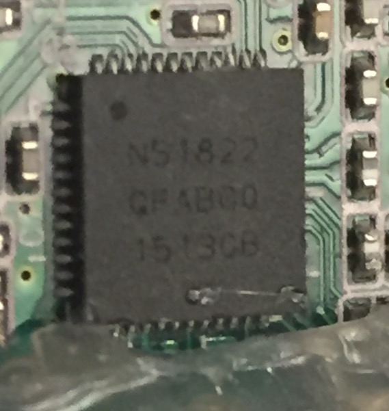

|pin|arduino|role|
|---|-------|----|
|P0_11|D0|RX|
|P0_9|D1|TX|
|P0_10|D2|SDA0|
|P0_8|D3|SCL0|
|P0_21|D4||
|P0_23|D5||
|P0_16|D6||
|P0_17|D7|SPI CS|
|P0_19|D8||
|P0_18|D9||
|P0_14|D10||
|P0_12|D11||
|P0_13|D12||
|P0_15|D13|LED|
|P0_29|D14|TWI_SDA SDA1|
|P0_28|D15|TWI_SCL SCL1|
|P0_25|D16|SPI SCK|
|P0_22|D17|SPI MISO|
|P0_20|D18|SPI MOSI|
|P0_1|D19|A0|
|P0_2|D20|A1|
|P0_3|D21|A2|
|P0_4|D22|A3|
|P0_5|D23|A4|
|P0_6|D24|A5|	

		